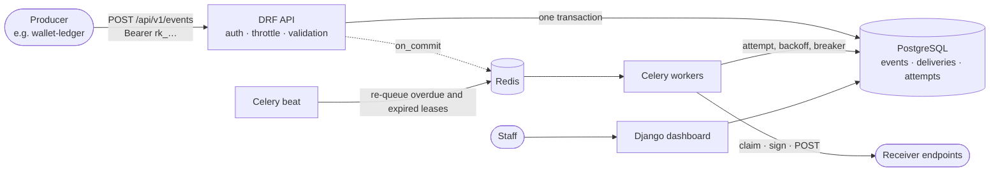

# Webhook Relay

Reliable webhook delivery as a service: signed requests, retries with exponential backoff and jitter, a dead-letter queue, a circuit breaker per endpoint and replay.

[](https://github.com/Tutzdev/webhook-relay/actions/workflows/ci.yml)


## The problem

"Call the customer's URL when something happens" is one line of code until production:

- The receiver is down for ten minutes and every event of those ten minutes is lost.
- Retrying in a tight loop hammers a server that is already struggling, and all retries land in the same second.
- The receiver cannot tell a real request from a forged one, or from an old one replayed by an attacker.
- A tenant registers `http://169.254.169.254/` and your server happily fetches the cloud metadata for them (SSRF).
- A dead endpoint keeps getting thousands of requests a day, forever.
- Support asks "did we send it?" and nobody can answer.

This service takes events from producers, such as [wallet-ledger](https://github.com/Tutzdev/wallet-ledger), and delivers them to every subscribed endpoint while handling all of the above.

## Backend highlights

- **Signed with the [Standard Webhooks](https://www.standardwebhooks.com) spec.** Headers: `webhook-id`, `webhook-timestamp` and `webhook-signature` (`v1,<base64 HMAC-SHA256>` of `id.timestamp.body`). Receivers can verify with an off-the-shelf library, and the timestamp blocks replay attacks.
- **Secret rotation without downtime.** After a rotation, both the new and the previous secret sign every request for 24 hours, so a receiver can switch keys without dropping an event.
- **Retries with exponential backoff and equal jitter.** The wait doubles on every attempt up to 6 hours, half fixed and half random, so a thousand deliveries that failed together do not retry together. After the last attempt the delivery goes to the dead-letter queue.
- **Circuit breaker per endpoint.** An endpoint is disabled only after many consecutive failures *and* a minimum time failing, so a short blip during a deploy does not switch it off. Staff re-enable it and replay its dead letters with one click.
- **Exactly one sender per attempt.** A worker claims a delivery with a conditional `UPDATE ... WHERE status = 'pending'`, so a task that runs twice sends once, and no database lock is held during the HTTP call. A lease brings back deliveries from workers that crashed mid-request.
- **Nothing is lost between the database and the queue.** The event and its deliveries are written in one transaction, tasks are queued with `transaction.on_commit`, and a Celery beat job re-queues anything overdue, which covers lost broker messages.
- **SSRF protection.** Endpoint URLs must be `https` and must resolve to public IPs. The check runs when the endpoint is registered and again before every request, because DNS can change in between. Redirects are not followed.
- **Rate limit per endpoint**, counted in Redis so it holds across every worker process. The API also throttles event ingestion per tenant.
- **Idempotent ingestion.** An `idempotency_key` per tenant returns the original event instead of creating a duplicate. The Ledger sends its outbox id, which makes its at-least-once publishing effectively-once.
- **Multi-tenant by construction.** API keys are `rk_<lookup>_<secret>`; only a SHA-256 hash is stored, compared in constant time. Every query starts from the key's tenant.
- **Full audit trail.** Every attempt stores the status code, the error, the first KB of the response and the duration.
- **Errors as Problem Details (RFC 9457)** with a stable `code`, from a custom DRF exception handler.

## Business rules

| Rule | Where it is enforced |
| --- | --- |
| An event goes only to **active** endpoints subscribed to its type (an empty filter means all types) | `services/publishing.py` |
| A 2xx answer is a success. Anything else, a timeout or a connection error is a failed attempt | `services/delivery.py` |
| Up to 8 attempts (configurable), then the delivery is **dead** | `RetryPolicy`, `_record` |
| An endpoint is disabled after 15 consecutive failures *and* at least 1 hour of failing (both configurable) | `Endpoint.record_failure` |
| Deliveries for a disabled endpoint are not sent; they become dead and can be replayed later | `attempt_delivery` |
| Only finished deliveries (succeeded or dead) can be replayed, and only to an active endpoint | `replay`, `replay_dead` |
| The signing secret is returned only on creation, rotation and `GET /secret`, never in listings | `EndpointViewSet` |
| Payloads are JSON objects of at most 64 KB; event types match `^[a-z0-9][a-z0-9_.-]{0,99}$` | `EventCreateSerializer` |

## Architecture



The life of one delivery:

1. `publish_event` stores the event and one `Delivery` per subscribed endpoint, then queues a task after commit.
2. The worker claims the row (`pending` → `sending`, with a 60 s lease). If the claim fails, another worker already has it.
3. It checks that the endpoint is active, takes a rate-limit slot, validates the URL against SSRF, signs the body and sends it with connect and read timeouts.
4. It records the attempt. Success resets the endpoint's failure streak. A failure feeds the circuit breaker and either schedules the next attempt (back to `pending`) or ends the delivery as `dead`.

```
config/       settings (12-factor, everything from the environment), Celery app, URLs
tenants/      Tenant, hashed ApiKey, DRF authentication and permission, create_tenant command
webhooks/
  models.py   Endpoint (breaker, rotation), Event, Delivery, DeliveryAttempt
  services/   publishing, delivery, signing, retry_policy, url_guard, rate_limit
  api/        serializers, viewsets, Problem Details handler
  tasks.py    deliver_webhook, requeue_due_deliveries
dashboard/    staff dashboard (Django templates, session login with CSRF)
demo/         signature-verifying receiver (ok / fail / flaky / slow) and the seed_demo command
tests/        pytest suite
```

## API

Authentication: `Authorization: Bearer rk_…` (create a key with `python manage.py create_tenant "<name>"`).

| Method | Path | Description |
| --- | --- | --- |
| `POST` | `/api/v1/events` | Publish an event (`event_type`, `payload`, optional `idempotency_key`). `201` new, `200` replayed |
| `GET` | `/api/v1/events` | List events |
| `GET` | `/api/v1/events/{id}` | Event with the status of each delivery |
| `POST` | `/api/v1/endpoints` | Register an endpoint (`url`, `event_types`, `rate_limit_per_second`). Returns the secret |
| `GET` `PATCH` `DELETE` | `/api/v1/endpoints/{id}` | Read, update or remove an endpoint |
| `GET` | `/api/v1/endpoints/{id}/secret` | Current signing secret |
| `POST` | `/api/v1/endpoints/{id}/rotate-secret` | New secret; the old one keeps signing for 24 h |
| `POST` | `/api/v1/endpoints/{id}/enable` | Close the circuit breaker |
| `POST` | `/api/v1/endpoints/{id}/replay-dead` | Queue every dead delivery of the endpoint again |
| `GET` | `/api/v1/deliveries` | List deliveries (`?status=`, `?endpoint=`) |
| `GET` | `/api/v1/deliveries/{id}` | Delivery with every attempt |
| `POST` | `/api/v1/deliveries/{id}/replay` | Send a finished delivery again |

```bash
curl -X POST localhost:8000/api/v1/events \
  -H "Authorization: Bearer $RELAY_API_KEY" -H "Content-Type: application/json" \
  -d '{"event_type":"deposit.posted","payload":{"amount":"12.34","currency":"BRL"},"idempotency_key":"outbox-42"}'
```

What the receiver gets:

```http
POST /webhooks HTTP/1.1
Content-Type: application/json
webhook-id: msg_2fe616a7b6ff47ff9cb04abe3180ae29
webhook-timestamp: 1791487777
webhook-signature: v1,K5oZfzN95Z9UVu1EsfQmfVNQhnkZ2pj9o9NDN/H/pI4=

{"type":"deposit.posted","timestamp":"2026-10-08T18:09:37.112Z","data":{"amount":"12.34","currency":"BRL"}}
```

Verifying on the receiver side (the same function the demo receiver uses):

```python
from webhooks.services.signing import verify

if not verify(secret, request.headers, request.body, now=int(time.time())):
    return HttpResponse(status=401)
```

## Technical decisions

- **Claim with a conditional UPDATE instead of `SELECT ... FOR UPDATE`.** A row lock would stay open for the whole HTTP call, up to 13 seconds per delivery. The claim is a single statement, and the lease covers the crash case.
- **Celery ETA plus a beat sweeper.** The task schedules its own retry with `eta`, which is fast. Redis can lose or redeliver long-ETA messages, so the database stays the source of truth: the sweeper re-queues anything overdue, and the claim makes duplicates harmless.
- **The `webhook-id` is the event id**, stable across retries and replays, so receivers deduplicate on it. Delivery is at-least-once by design.
- **Equal jitter instead of full jitter.** Full jitter can retry almost immediately after a failure. Keeping half of the window fixed guarantees a minimum pause.
- **The breaker needs both a count and a duration.** A count alone disables busy endpoints after a 30-second blip. A duration alone disables quiet endpoints after a single failure.
- **Server-rendered dashboard.** Django templates with session login and CSRF: no separate frontend build, and the same auth model as the admin.

## Tests

```bash
pip install -r requirements-dev.txt
pytest        # SQLite locally; CI runs the suite against PostgreSQL 17
ruff check .
```

30 tests, among them:

- **Delivery:** signed success verified with the endpoint secret, retry scheduling, network errors, dead letter after the last attempt, the circuit breaker opening, a task that runs twice sending once, SSRF blocked at send time, replay rules.
- **Signing:** round trip, tampered body, a stale timestamp, both secrets valid during a rotation.
- **URL guard:** loopback, private ranges, link-local metadata and Docker bridge addresses are rejected; https is required.
- **API:** 401 as Problem Details, fan-out only to active subscribed endpoints, idempotent publish, tenant isolation, a secret returned once, internal URLs rejected.

CI also fails when a model change has no migration (`makemigrations --check`).

## Running locally

```bash
cp .env.example .env
docker compose up --build                      # web :8000 + worker + beat + PostgreSQL + Redis
docker compose exec web python manage.py createsuperuser
docker compose exec web python manage.py seed_demo --base-url http://web:8000 --events 30
```

Open `http://localhost:8000/dashboard/` and watch the four demo endpoints: one always succeeds, one is flaky and recovers after retries, one is slow, and one stays down until its circuit opens.

To feed it from the Ledger, start [wallet-ledger](https://github.com/Tutzdev/wallet-ledger) with `LEDGER_EVENTS_PUBLISHER=relay`, `RELAY_URL=http://localhost:8000` and the API key printed by `seed_demo` or `create_tenant`.

## Interface

A staff dashboard (Django templates) shows the 24-hour success rate, latency, in-flight deliveries and dead letters, endpoint health with enable and replay-dead actions, recent deliveries filtered by status, and a detail page with the payload, every attempt and a replay button.

## Next steps

- Encrypt signing secrets at rest (they must stay readable to sign, so they cannot be hashed).
- Cap attempts per tenant per minute to isolate noisy tenants on shared workers.
- Retention job for old attempts and events.
- Ordered delivery per endpoint for producers that need it.
